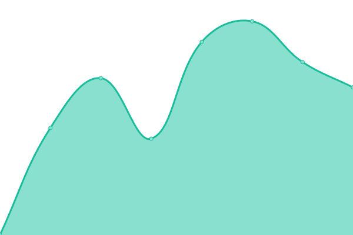
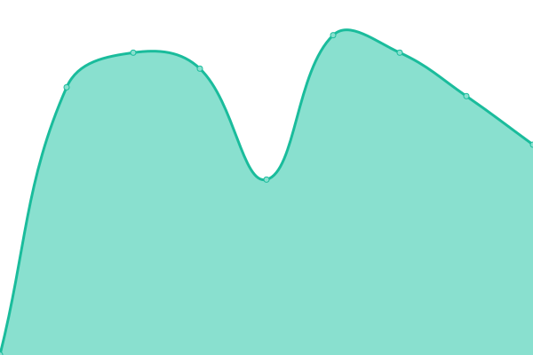
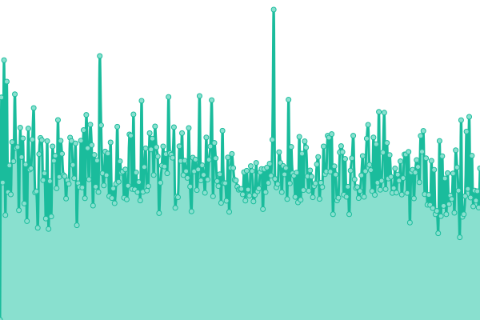
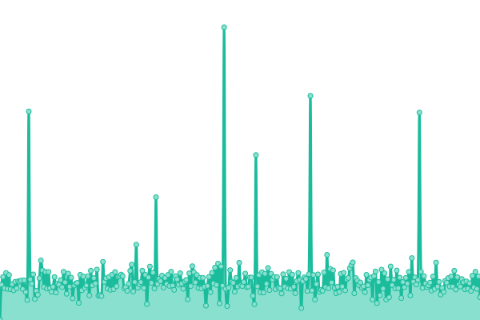
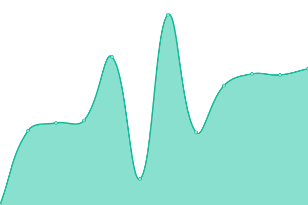

# [📈 Live Status](https://lanen.github.io): <!--live status--> **🟧 Partial outage**

This repository contains the open-source uptime monitor and status page for [evan](https://lanen.github.io), powered by [Upptime](https://github.com/upptime/upptime).

With [Upptime](https://upptime.js.org), you can get your own unlimited and free uptime monitor and status page, powered entirely by a GitHub repository. We use [Issues](https://github.com/lanen/bs-site/issues) as incident reports, [Actions](https://github.com/lanen/bs-site/actions) as uptime monitors, and [Pages](https://lanen.github.io) for the status page.

<!--start: status pages-->
<!-- This summary is generated by Upptime (https://github.com/upptime/upptime) -->
<!-- Do not edit this manually, your changes will be overwritten -->
<!-- prettier-ignore -->
| URL | Status | History | Response Time | Uptime |
| --- | ------ | ------- | ------------- | ------ |
|  [Buckydrop](https://www.buckydrop.com) | 🟩 Up | [buckydrop.yml](https://github.com/lanen/bs-site/commits/HEAD/history/buckydrop.yml) | 

 514ms
     
 | 

<a href="https://lanen.github.io/bs-site/history/buckydrop">100.00%</a>
    

|  Buckydrop BD | 🟥 Down | [buckydrop-bd.yml](https://github.com/lanen/bs-site/commits/HEAD/history/buckydrop-bd.yml) | 

 3707ms
     
 | 

<a href="https://lanen.github.io/bs-site/history/buckydrop-bd">0.00%</a>
    

|  [Superbuy](https://www.superbuy.com) | 🟩 Up | [superbuy.yml](https://github.com/lanen/bs-site/commits/HEAD/history/superbuy.yml) | 

 648ms
     
 | 

<a href="https://lanen.github.io/bs-site/history/superbuy">100.00%</a>
    

|  [Superbuy Login](https://login.superbuy.com) | 🟩 Up | [superbuy-login.yml](https://github.com/lanen/bs-site/commits/HEAD/history/superbuy-login.yml) | 

 671ms
     
 | 

<a href="https://lanen.github.io/bs-site/history/superbuy-login">100.00%</a>
    

|  [ctiktok.net](https://www.ctiktok.net) | 🟥 Down | [ctiktok-net.yml](https://github.com/lanen/bs-site/commits/HEAD/history/ctiktok-net.yml) | 

 0ms
     
 | 

<a href="https://lanen.github.io/bs-site/history/ctiktok-net">0.00%</a>
    

|  [rexingsports.cn](https://www.rexingsports.cn) | 🟥 Down | [rexingsports-cn.yml](https://github.com/lanen/bs-site/commits/HEAD/history/rexingsports-cn.yml) | 

 873ms
     
 | 

<a href="https://lanen.github.io/bs-site/history/rexingsports-cn">87.24%</a>
    

|  [vipgifts.net](https://vipgifts.net) | 🟥 Down | [vipgifts-net.yml](https://github.com/lanen/bs-site/commits/HEAD/history/vipgifts-net.yml) | 

 941ms
     
 | 

<a href="https://lanen.github.io/bs-site/history/vipgifts-net">86.82%</a>
    

|  [trixmall.com](https://www.trixmall.com/) | 🟩 Up | [trixmall-com.yml](https://github.com/lanen/bs-site/commits/HEAD/history/trixmall-com.yml) | 

 685ms
     
 | 

<a href="https://lanen.github.io/bs-site/history/trixmall-com">100.00%</a>
    

|  [Myus](https://chinamarketplace.myus.com) | 🟩 Up | [myus.yml](https://github.com/lanen/bs-site/commits/HEAD/history/myus.yml) | 

 627ms
     
 | 

<a href="https://lanen.github.io/bs-site/history/myus">100.00%</a>
    

<!--end: status pages-->

[**Visit our status website →**](https://lanen.github.io)

## 📄 License

- Powered by: [Upptime](https://github.com/upptime/upptime)
- Code: [MIT](./LICENSE) © [evan](https://lanen.github.io)
- Data in the `./history` directory: [Open Database License](https://opendatacommons.org/licenses/odbl/1-0/)
